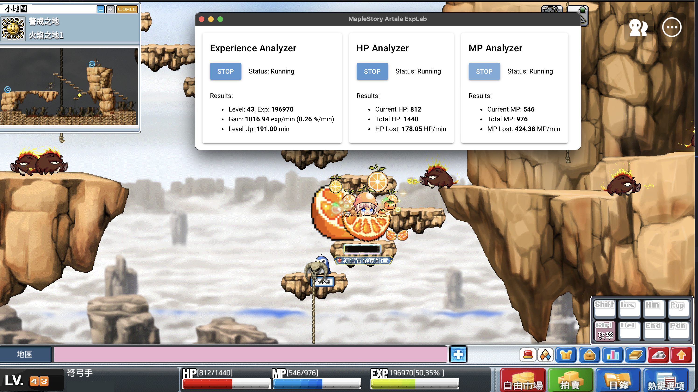

# MapleStory Artale ExpLab

[](https://opensource.org/licenses/BSD-3-Clause)
[](https://github.com/astral-sh/ruff)

**English** | [中文](README.zh.md)

A cross-platform Python tool that monitors MapleStory Artale player experience efficiency, HP, and MP consumption using pure computer vision techniques, allowing real-time assessment of player training efficiency.


<small>Figure. Display experience efficiency, estimated time to level up, and HP/MP consumption.</small>

## Features

- Based on computer vision technology, not involving script injection/tampering with game data.
- Cross-platform support (Windows, macOS).
- Almost no configuration (so far).

## Installation

This project uses [uv](https://github.com/astral-sh/uv) to manage dependencies and the execution environment.

1. Install uv (if not already installed):

```bash
# On Windows.
powershell -ExecutionPolicy ByPass -c "irm https://astral.sh/uv/install.ps1 | iex"

# On macOS.
# curl -LsSf https://astral.sh/uv/install.sh | sh

# Or pip.
# pip install uv
```

2. Sync project dependencies:

```bash
uv sync
```

3. Install PaddlePaddle:

Please follow the [PaddlePaddle official website](https://www.paddlepaddle.org.cn/install/quick?docurl=/documentation/docs/zh/develop/install/pip/windows-pip.html) to install CUDA-based PyTorch.

```bash
# An example to install CUDA 12.9-based PaddlePaddle
uv pip install paddlepaddle-gpu==3.2.2 -i https://www.paddlepaddle.org.cn/packages/stable/cu129/

# Another example to install CUDA 12.6-based PaddlePaddle
# uv pip install paddlepaddle-gpu==3.2.2 -i https://www.paddlepaddle.org.cn/packages/stable/cu126/
```

## Usage

```bash
uv run python main.py
```

## Contributing

Due to the author's busy full-time job, it may not be possible to respond to all requests immediately. However, please feel free to submit issues for discussions or pull requests for contributions.

## License

- In principle, follows the [BSD-3 License](./LICENSE).
- However, using this project for activities that may affect other players' gaming experience (e.g., bot farming) is not permitted.

## Disclosure

This project uses [GitHub Copilot](https://github.com/features/copilot) (mostly with Gemini 2.5 Pro) to generate some of the code. The main implementation has been reviewed manually, but errors or improper implementations may still exist. If you find any issues, please feel free to submit an issue or pull request.

## TODO

See [#1](https://github.com/StephLin/maplestory-artale-explab/issues/1) for details.
