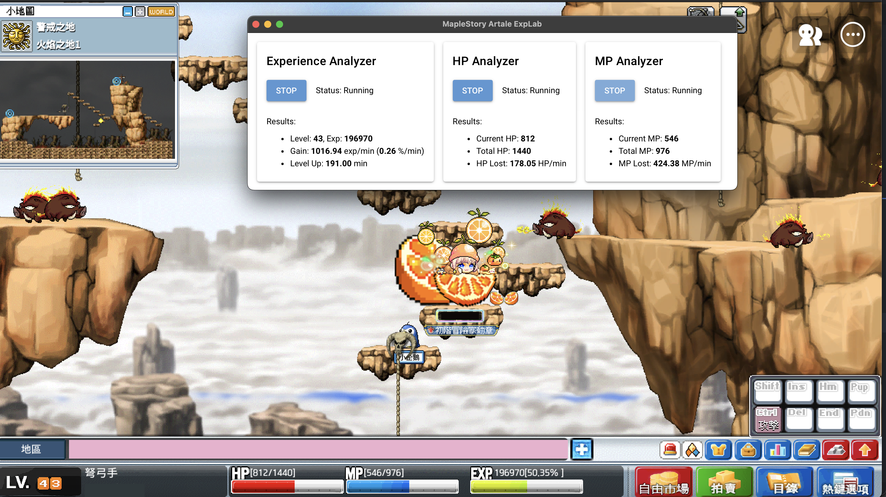

# MapleStory Artale ExpLab

[English](./README.md) | **中文**

一個跨平台 Python 工具，透過純電腦視覺技術監測 MapleStory Artale 玩家經驗值效率、血量與魔力耗損，即時檢視玩家是否高效率練功。


<small>圖. 在介面上可以檢視經驗值效率、預期升等所需時間、血量與魔力耗損。</small>

## 特色

- 基於電腦視覺技術，不牽涉腳本注入/竄改遊戲數據
- 跨平台支援 (Windows、macOS)
- 幾乎不需要做任何設定 (至少目前是這樣)

## 安裝

本專案使用 [uv](https://github.com/astral-sh/uv) 管理依賴與執行環境。

1. 安裝 uv（若尚未安裝）：

```bash
# On Windows.
powershell -ExecutionPolicy ByPass -c "irm https://astral.sh/uv/install.ps1 | iex"

# On macOS.
# curl -LsSf https://astral.sh/uv/install.sh | sh

# Or pip.
# pip install uv
```

2. 同步專案依賴：

```bash
uv sync
```

3. (搭載 Nvidia GPU 的 Windows, 選擇性) 安裝基於 CUDA 的 PyTorch:

請按照 [PyTorch 官方網站](https://pytorch.org/get-started/locally/) 說明以安裝基於 CUDA 的 PyTorch.

```bash
# An example to install CUDA 12.8-based PyTorch
uv pip install torch torchvision torchaudio --index-url https://download.pytorch.org/whl/cu128

# Another example to install CUDA 12.6-based PyTorch
# uv pip install torch torchvision torchaudio --index-url https://download.pytorch.org/whl/cu126
```

## 使用方式

```bash
uv run python main.py
```

## 貢獻

因為作者工作繁忙，可能無法即時回應所有需求。但歡迎提交 Issue 討論或提交 Pull Request.

## 授權

- 原則上遵循 [BSD-3 License](./LICENSE)
- 但不允許將此專案用於可能會影響其他玩家遊戲體驗 (如腳本刷怪) 的行為

## 聲明

本專案使用 GitHub Copilot (其中絕大多數使用 Gemini 2.5 Pro) 生成部分程式碼。原則上核心實作已通過人工審核，但仍可能存在錯誤或不當實作。若發現問題，歡迎提出 Issue 或 Pull Request。

## 已知問題 & 開發清單

See [#1](https://github.com/StephLin/maplestory-artale-explab/issues/1) for details.
